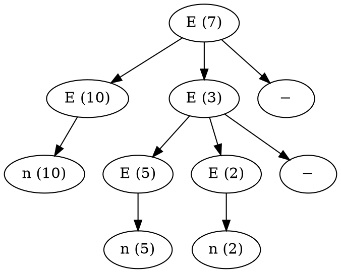
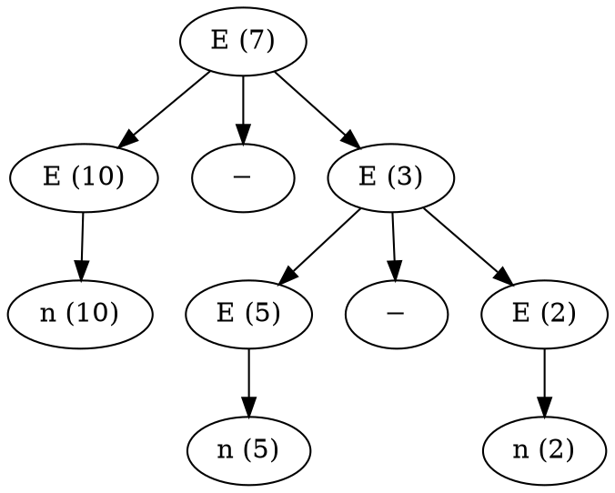

# Лабораторная работа № 2.3 «Синтаксический анализатор на основе предсказывающего анализа»

## 1 Цель работы

Целью данной работы является изучение алгоритма построения таблиц предсказывающего анализатора.

## 2 Исходные данные

В данной лабораторной работе требуется разработать синтаксический анализатор на основе предсказывающего анализа, который принимая на входе текст на входном языке, на выходе порождает дерево вывода для входного текста.

В качестве входного языка должен выступать язык представления правил грамматики, варианты лексики и синтаксиса которого можно восстановить из примера в индивидуальном варианте.

### 2.1 Индивидуальный вариант

```
$ ключевые слова
$ начинаются с обратной кавычки

F  `is "n" `or "(" E ")" `end
T  `is F T1 `end
T1 `is "*" F T1 `or `epsilon `end
`axiom E  `is T E1 `end
E1 `is "+" T E1 `or `epsilon `end
```

## 3 Задание

Выполнение лабораторной работы состоит из следующих этапов:

- Составление описаний лексической структуры и грамматики входного языка на основе примера из индивидуального варианта.
- Разработка лексического анализатора для входного языка. Лексический анализ может выполняться любым из ранее изученых способов.
- Составление (вручную) таблицы предсказывающего разбора для входного языка.
- Разработка алгоритма предсказывающего разбора, работающего на основе порождённой таблицы. Реализация этого алгоритма.

В отчёте по лабораторной работе обязательно должно присутствовать описание синтаксиса входного языка — как неформальное (своими словами), так и формализованное (лексическая структура и грамматика).

Отметим, что парсер входного языка должен выдавать сообщения об обнаруженных ошибках, включающие координаты ошибки. Восстановление при ошибках, а также выдачу специфических текстовых описаний ошибок реализовывать не нужно.

В качестве языков реализации разрешается использовать C++, Java/C#, Go, Ruby или Python. Также допустимо использование языков Scheme/Clojure, Scala, Rust и других, при условии, что выбранный язык поддерживает тип данных «массив» с константным временем доступа по индексу.

### 3.1 Отображение графов в Graphviz

Graphviz может менять порядок потомков узла, что неприемлемо для дерева вывода (которое, как мы помним, упорядоченный граф). Для того, чтобы порядок дочерних узлов фиксировать, нужно добавить невидимые связи между ними как в примерах ниже.

Graphviz может не сохранять порядок дочерних узлов в дереве. Например, для следующего исходника построится неправильный граф:



Для указания порядка нужно дочерние узлы соединить невидимыми дугами:


